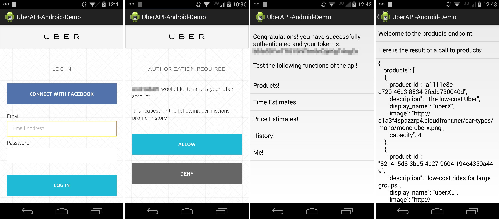

UberAPI-Android-Demo
====================

What Is This?
-------------

This is a simple Android application intended to provide a working example of Uber's external API. It provides the same functionality as their [python sample code](https://github.com/uber/Python-Sample-Application).

How To Use This
---------------

1. Navigate over to https://developer.uber.com/, and sign up for an Uber developer account.
2. Register a new Uber application - `profile` and `history` OAuth scopes are required.
3. Fill in the relevant information in the AndroidManifest.xml file in the `app/src/main`. Add your client id, secret and redirect url in their respective `meta-data` elements.
3. Open the UberAPI-Android-Demo in Android Studio or build it from the command line using Gradle.
5. Run the app

License
=======

    Copyright 2014 Rahul Parsani

    Licensed under the Apache License, Version 2.0 (the "License");
    you may not use this file except in compliance with the License.
    You may obtain a copy of the License at

       http://www.apache.org/licenses/LICENSE-2.0

    Unless required by applicable law or agreed to in writing, software
    distributed under the License is distributed on an "AS IS" BASIS,
    WITHOUT WARRANTIES OR CONDITIONS OF ANY KIND, either express or implied.
    See the License for the specific language governing permissions and
    limitations under the License.

Library licenses
================

__retrofit-1.6.1__ is subject to the [Apache License, Version 2.0](http://apache.org/licenses/LICENSE-2.0.html).
More information on [the official web site](http://square.github.io/retrofit/).

__appcompat-v7__ is subject to the [Apache License, Version 2.0](http://apache.org/licenses/LICENSE-2.0.html).